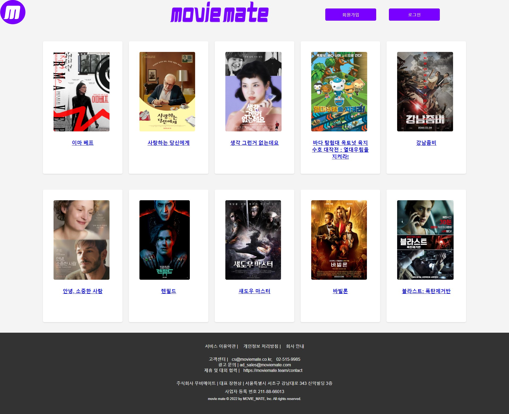
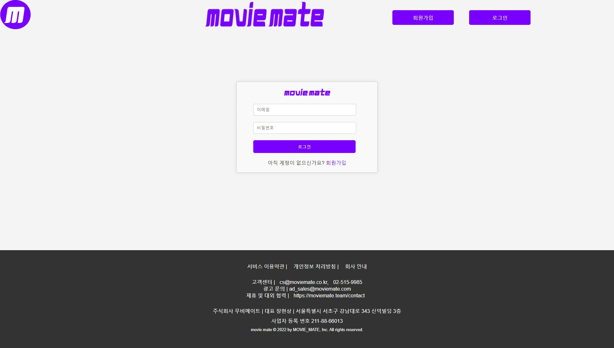
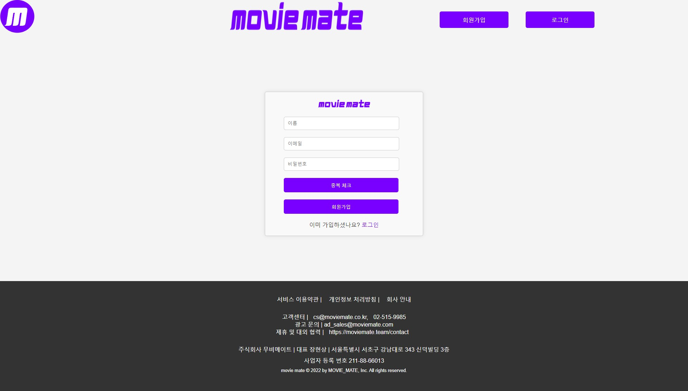

# 리액트를 활용하여 영화 정보 웹 제작 🎬

무비메이트 스프링부트 프로젝트를 리액트로 변환하는 작업

## 1) 프로젝트 진행 절차

###  **1. 프로젝트 구조 및 의존성 확인:**
- 기존 스프링부트 프로젝트의 구조를 파악하고, 사용된 의존성(라이브러리, 데이터베이스 등)을 정리합니다.

###  **2. React 프로젝트 생성:**
- 인텔리제이를 사용하여 새로운 리액트 프로젝트를 만듭니다.

###  **3. 프로젝트 설정 및 환경 변수:**
- 기존 스프링부트에서 사용된 설정과 환경 변수를 살펴보고, 리액트 프로젝트에 적용합니다.

###  **4. 라우팅 설정:**
- React Router를 사용하여 페이지 간의 라우팅을 설정합니다. 기존 스프링부트에서 사용한 URL 매핑을 고려하여 라우팅을 구성합니다.

###  **5. 백엔드 API 연동:**
- 영화 정보를 담고 있는 API를 호출하는 코드를 작성합니다.

###  **6. 컴포넌트 변환:**
- 기존의 백엔드 뷰(화면)를 리액트 컴포넌트로 변환합니다. 각 뷰는 컴포넌트로 분리하고, 재사용 가능한 컴포넌트를 만듭니다.

###  **7. 상태 및 이벤트 처리:**
- 리액트의 상태 관리 라이브러리 (예: Redux, Context API)를 선택하고, 상태 및 이벤트 처리를 구현합니다.

###  **8. 스타일 적용:**
- CSS 스타일링 방법을 선택하고, 기존 스프링부트의 스타일을 리액트 프로젝트에 적용합니다.

## 2) 프로젝트 페이지 구성

### 메인화면
1. **영화 API 연동 및 데이터 출력**
    - 외부 영화 API를 활용하여 영화 목록 및 정보를 가져온다. 🎥
    - 가져온 데이터를 화면에 출력한다. 📊
    - 각 영화에는 제목, 포스터 이미지, 간단한 설명 등이 포함되어야 한다. 🌟

2. **영화 상세 정보 팝업**
    - 각 영화에 대한 상세 정보 팝업을 구현한다. 📝
    - 사용자가 영화를 클릭하면 해당 영화의 상세 정보(감독, 출연 배우, 개봉일, 등급 등)를 팝업으로 표시한다. 🎬

### 로그인
1. **회원 정보 확인**
    - 로그인 화면에서 사용자가 아이디와 비밀번호를 입력하면, 로컬 스토리지에 저장된 회원가입 정보를 확인한다. 🔐

2. **로그인 처리**
    - 입력된 아이디와 비밀번호가 회원 목록에 있는지 확인한다. 🔄
    - 맞다면 로그인 성공 처리를 하고, 로그인 상태를 유지한다. ✅
    - 틀렸다면 적절한 메시지를 출력한다. ❌

### 회원가입
1. **회원가입 양식 구현**
    - 필요한 정보(아이디, 비밀번호, 이메일 등)를 입력할 수 있는 회원가입 양식을 제공한다. 📝

2. **로컬 스토리지에 회원 정보 저장**
    - 입력된 정보를 로컬 스토리지에 저장하여 회원 목록을 관리한다. 💾

3. **유효성 체크**
    - 입력된 정보가 유효한지 확인한다. (예: 이메일 형식, 비밀번호 강도 등) ✅

4. **회원가입 완료 페이지**
    - 회원가입이 성공적으로 이루어진 경우, 완료 페이지를 표시하고 로그인 페이지로 이동할 수 있는 링크를 제공한다. 🎉

### 헤더와 풋터
1. **헤더**
    - 홈페이지로 이동할 수 있는 로고 또는 홈 버튼을 제공한다. 🏠
    - 로그인 상태에 따라 로그인/로그아웃 버튼을 동적으로 표시한다. 🔒

2. **풋터**
    - 홈페이지에 대한 간단한 정보 또는 연락처를 표시한다. 📞
    - 소셜 미디어 링크 또는 기타 유용한 링크를 제공한다. 🔗

### 상세보기
1. **상세정보 페이지 구현**
    - 메인화면에서 영화를 클릭하면 해당 영화의 상세 정보 페이지로 이동한다. 🚀
    - 상세 정보에는 감독, 출연 배우, 개봉일, 등급 등의 정보가 포함되어야 한다. 📌
    - 사용자가 다시 메인화면으로 돌아갈 수 있는 버튼을 제공한다. ⬅️

## 3) 화면 이미지

### 메인화면

### 로그인 화면

### 회원가입 화면

### 상세보기 화면

